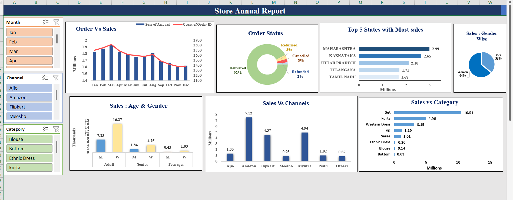
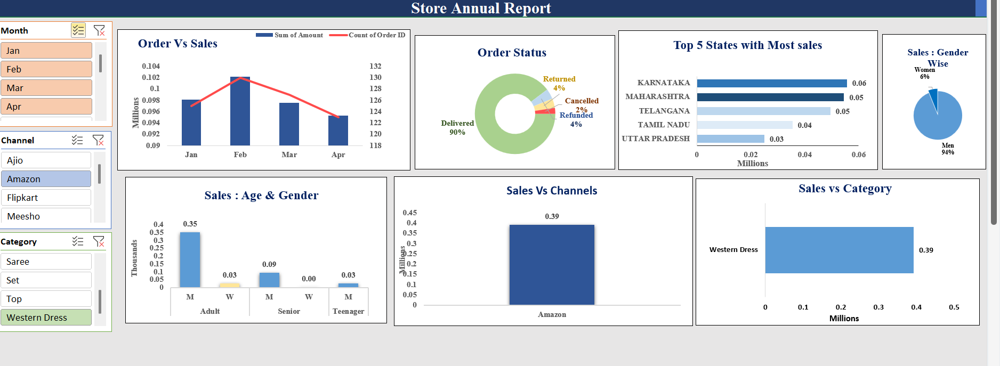

# Excel Sales Dashboard – Mini Project

## Overview
This project is a basic **Excel Sales Dashboard** created to practice data cleaning, analysis, and visualization using Excel. The dashboard uses **Pivot Tables, Pivot Charts, and Slicers** to analyze sales data and generate insights for the year 2022.

## Data Preparation
- Cleaned the dataset by removing duplicates and handling inconsistent values.
- Standardized categories such as gender, order status, and sales channels.
- Formatted columns (dates, numbers, and text) for proper analysis.

## Tools & Features Used
- Pivot Tables
- Pivot Charts
- Slicers for interactive filtering
- Data Cleaning and Formatting
- Dashboard layout design in Excel

## Key Questions Answered
1. Compare **sales and orders** using a single chart.
2. Identify the **month with the highest sales and orders**.
3. Determine **who purchased more – men or women (2022)**.
4. Analyze **different order statuses in 2022**.
5. Find the **top 5 states contributing to sales**.
6. Analyze the **relationship between age group and gender based on number of orders**.
7. Identify **which sales channel contributes the most sales**.
8. Determine the **highest selling category**.

## Dashboard Preview

